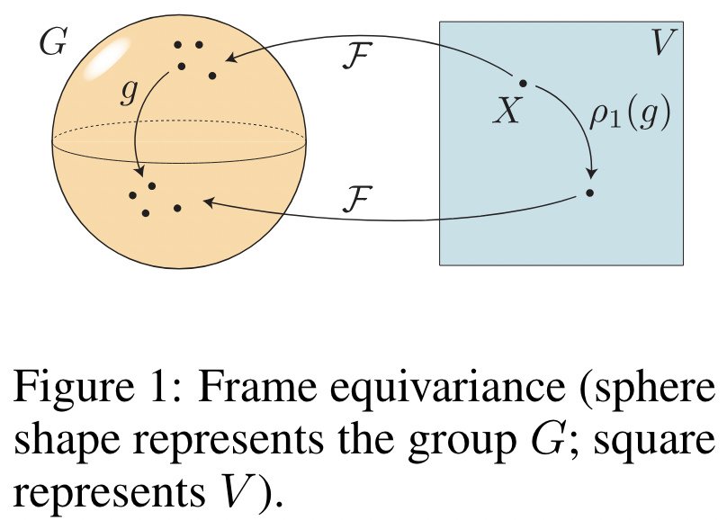

</img>

## Frame Averaging - Pytorch (wip)

Pytorch implementation of a simple way to enable <a href="https://arxiv.org/abs/2305.05577">(Stochastic)</a> <a href="https://arxiv.org/abs/2110.03336">Frame Averaging</a> for any network

## Install

```bash
$ pip install frame-averaging-pytorch
```

## Usage

```python
import torch
from frame_averaging_pytorch import FrameAverage

# contrived neural network

net = torch.nn.Linear(3, 3)

# wrap the network with FrameAverage

net = FrameAverage(
    net,
    dim = 3,           # defaults to 3 for spatial, but can be any value
    stochastic = True  # whether to use stochastic variant from FAENet (one frame sampled at random)
)

# pass your input to the network as usual

points = torch.randn(2, 4, 1024, 3)

out = net(points)

out.shape # (2, 4, 1024, 3)

# frame averaging is automatically taken care of, as though the network were unwrapped
```

## Citations

```bibtex
@article{Puny2021FrameAF,
    title   = {Frame Averaging for Invariant and Equivariant Network Design},
    author  = {Omri Puny and Matan Atzmon and Heli Ben-Hamu and Edward James Smith and Ishan Misra and Aditya Grover and Yaron Lipman},
    journal = {ArXiv},
    year    = {2021},
    volume  = {abs/2110.03336},
    url     = {https://api.semanticscholar.org/CorpusID:238419638}
}
```

```bibtex
@article{Duval2023FAENetFA,
    title   = {FAENet: Frame Averaging Equivariant GNN for Materials Modeling},
    author  = {Alexandre Duval and Victor Schmidt and Alex Hernandez Garcia and Santiago Miret and Fragkiskos D. Malliaros and Yoshua Bengio and David Rolnick},
    journal = {ArXiv},
    year    = {2023},
    volume  = {abs/2305.05577},
    url     = {https://api.semanticscholar.org/CorpusID:258564608}
}
```
